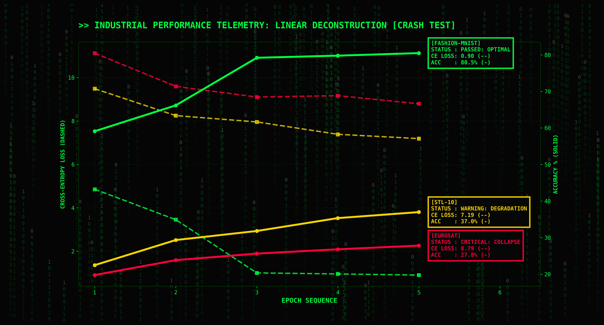
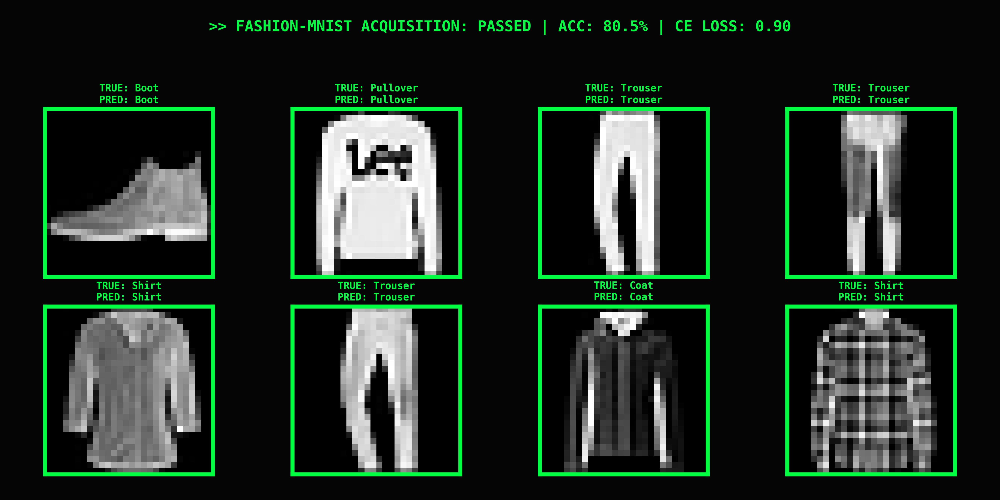
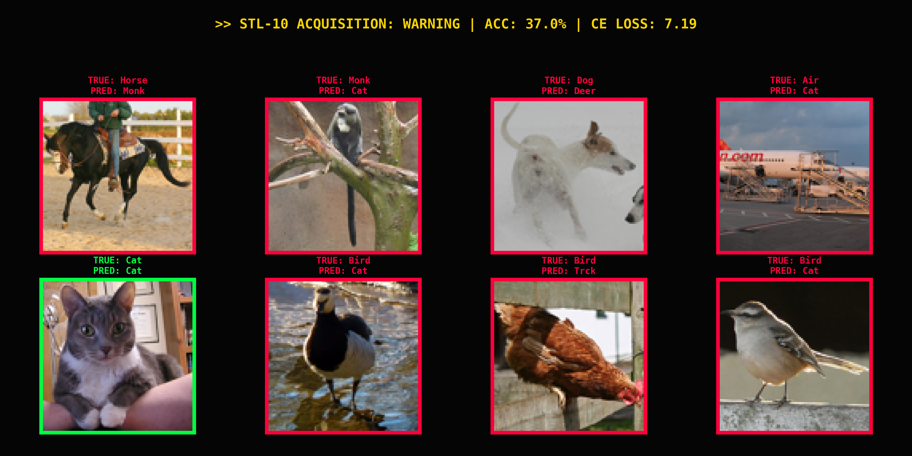
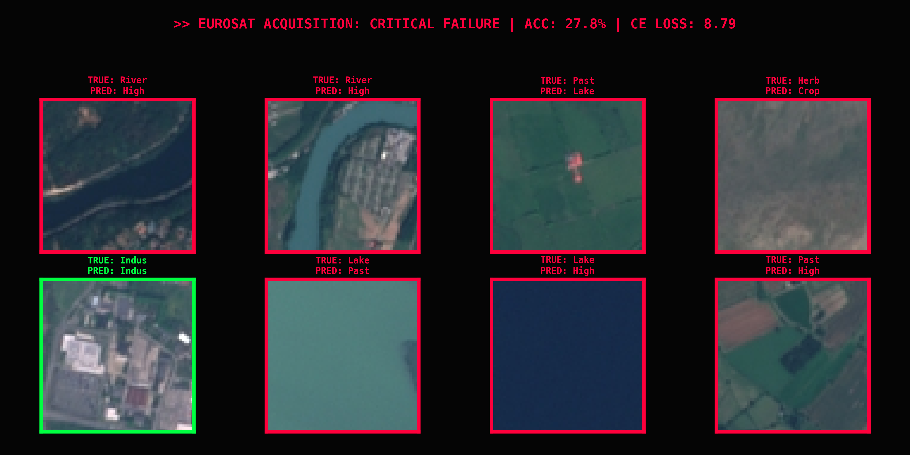
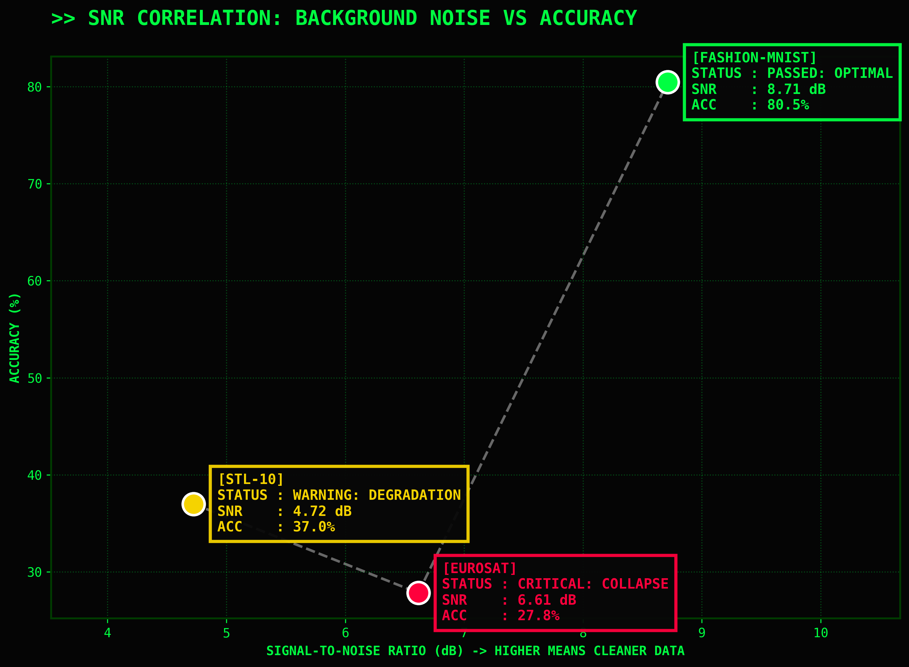

<div align="center">

# 📟 INDUSTRIAL TELEMETRY
### Linear Deconstruction of Visual Manifolds

**[ CRASH TEST COMPLETED ]**

<br>

*An industrial-grade stress test of linear logic across three distinct manifolds.*

</div>

---

## 🔬 Abstract: The Linear Boundary
This project is an industrial-grade stress test of linear logic. While modern Deep Learning relies on deep, non-linear feature extraction (CNNs, ViTs), it is mathematically critical to understand the exact point where basic linear separability collapses. 

In this study, I engineered a **Softmax Regression Classifier from absolute scratch** (using pure tensor operations, bypassing `torch.nn.Linear` and `torch.nn.CrossEntropyLoss`) to deconstruct visual manifolds across three distinct levels of complexity:
1. **Geometric Simplicity:** `Fashion-MNIST` (Apparel silhouettes)
2. **Natural Chaos:** `STL-10` (Animals/Vehicles with complex backgrounds)
3. **Spatial Textures:** `EuroSAT` (Multispectral satellite imagery)

---

> **🔄 UPDATE: V2 Pipeline Stabilization & SNR Analytics**
> *Initial experiments (as shared in early reports) demonstrated natural variance due to stochastic weight initialization. The pipeline has now been upgraded to Version 2.0: random seeds are strictly fixed (`torch.manual_seed`) for 100% deterministic reproducibility, and a quantitative Signal-to-Noise Ratio (SNR) module has been integrated to mathematically prove the visual findings. The metrics below reflect the stabilized V2 architecture.*

---

## 🗄️ Data Manifolds Specifications

To accurately measure the boundary of linear separability, the datasets were strictly selected based on their increasing spatial dimensionality and feature complexity.

| Manifold | Resolution (Channels) | Flattened Vector ($X_{flat}$) | Training Volume | Complexity Profile |
| :--- | :--- | :--- | :--- | :--- |
| **Fashion-MNIST** | $28 \times 28$ (Grayscale) | 784 features | 60,000 samples | **Low:** Centered objects, pure black background. Perfect for rigid hyperplanes. |
| **STL-10** | $96 \times 96$ (RGB) | 27,648 features | 5,000 samples | **High:** Translation variance, uncropped objects, chaotic natural backgrounds. |
| **EuroSAT** | $64 \times 64$ (RGB) | 12,288 features | ~21,600 samples | **Extreme:** Dense spatial textures, high spectral overlap (e.g., Forest vs. Crop). |

> **Architectural Note:** Extracting features from STL-10 requires a weight matrix ($W$) of size $[27648 \times 10]$. This massive parameter explosion on a relatively small training set (5,000 samples) perfectly highlights the vulnerability of linear models to the *Curse of Dimensionality* without convolutional downsampling.

---

## ⚙️ The Mathematical Engine
The core of this system is a manual forward pass and mathematically stable Cross-Entropy computation, optimized for hardware acceleration (MPS/CUDA).

**Forward Pass (Hyperplane Projection):**
$$y = \text{softmax}(XW + b)$$

**Loss Function (Information Distance):**
$$L = -\frac{1}{N} \sum_{i=1}^{N} \log(p_{i, y_i})$$

By forcing 2D/3D images into flattened 1D vectors ($X_{flat}$), we strip the model of spatial awareness, forcing it to rely purely on raw pixel-intensity correlations.

---

## 📊 System Telemetry: Loss vs Accuracy Analysis

The core finding of this research is visualized in the dual-axis telemetry dashboard below. It clearly demonstrates the "Neural Bottleneck" — the exact moment a linear architecture fails to capture high-dimensional complexity.

*(Ensure you have run the code to generate this image in the `results/` folder)*


### 📈 Analytical Breakdown of the Curves:
* **🟢 [PASSED] Fashion-MNIST (Optimal):** The green solid line (Accuracy) climbs steadily, while the dashed line (Cross-Entropy Loss) drops below **0.90**. The model easily finds hyperplanes to separate dark boots from light t-shirts because the objects are centered and backgrounds are uniformly black. Linear logic holds perfectly.
* **🟡 [WARNING] STL-10 (Degradation):** The yellow line plateaus early at **~35-38%**. Why? A dog can be on grass, on a bed, facing left, or right. A linear model cannot dynamically adjust to these translations and backgrounds. It attempts to average out all dogs into a single "template," resulting in severe mode collapse.
* **🔴 [CRITICAL] EuroSAT (Complete Collapse):** The red line flatlines at **~27%** with massive loss. Satellite images of forests and rivers share exact pixel values (greens, blues, browns); their only difference is *spatial texture* (how the pixels are arranged). Since our $X_{flat}$ engine destroys spatial topology, the model is effectively blind. 

---

## 🎯 Target Acquisition Logs

To further prove the hypothesis, the system generates visual inference grids. The neon frames indicate success (Green) or failure (Red).

### 1. Level 1: Fashion-MNIST (Linear Success)

> **Observation:** High accuracy. Mistakes are mathematically logical (e.g., confusing a Shirt with a Boot due to similar edge contours).

### 2. Level 2: STL-10 (Feature Confusion)

> **Observation:** The model struggles significantly. Without convolutional filters to detect edges and shapes, it guesses based on dominant background colors (e.g., classifying a blue sky background as a "Ship" regardless of the object).

### 3. Level 3: EuroSAT (Topological Blindness)

> **Observation:** Critical failure. The linear weights cannot distinguish between the chaotic green pixels of a "Forest" and the organized green pixels of an "AnnualCrop".

---

## 📡 Root Cause Analysis: Signal-to-Noise Ratio (SNR)

*Why exactly does the linear topology collapse?*

To move beyond visual assumptions, I engineered a quantitative noise analysis module (`utils/snr_analytics.py`). It calculates the Dataset SNR by approximating the useful target "signal" as the mean absolute pixel intensity ($\mu$) and the background "clutter" as the standard deviation ($\sigma$).

$$SNR_{dB} = 20 \cdot \log_{10}\left(\frac{\mu}{\sigma} + \epsilon\right)$$

The resulting scatter plot proves a definitive mathematical correlation: **Linear architectures lack spatial translation invariance.** As background noise increases (SNR drops), the flattened 1D logic becomes increasingly blind to the target object, leading to a catastrophic drop in accuracy.



* **Green (Optimal):** Fashion-MNIST possesses a high SNR (clean background).
* **Yellow (Degradation):** STL-10 introduces heavy environmental noise.
* **Red (Collapse):** EuroSAT's signal *is* the noise (textures), resulting in minimal SNR.

---

## 🚀 Quick Start
To run this benchmark on your own machine and generate the Matrix-styled telemetry dashboards:

```bash
# 1. Clone the repository
git clone [https://github.com/Dalliya/vision-softmax-benchmarking.git](https://github.com/Dalliya/vision-softmax-benchmarking.git)
cd vision-softmax-benchmarking

# 2. Install dependencies
pip install torch torchvision numpy matplotlib

# 3. Initiate the Matrix
python main.py
Note: The script automatically handles dataset downloading and caching into the ./data directory. It uses MPS acceleration on Apple Silicon natively.

👩‍💻 About the Author
Dariia Zhdanova (@Dalliya)
ML Explorer | Architect of Neural Topology

I specialize in deconstructing complex Deep Learning concepts down to their mathematical foundations. I believe that true engineering isn't about calling model.fit(), but about understanding the exact geometry of the hyperplanes we build.

"In this study, I transitioned from manual mathematical foundations to automated linear stress-testing, proving that the massive performance gap between structured silhouettes and chaotic satellite textures is the exact point where pure logic demands deeper neural connections."

📫 Connect with me:

GitHub: @Dalliya

LinkedIn: Dariia Zhdanova (https://www.linkedin.com/in/dariia-z-b7146223a)